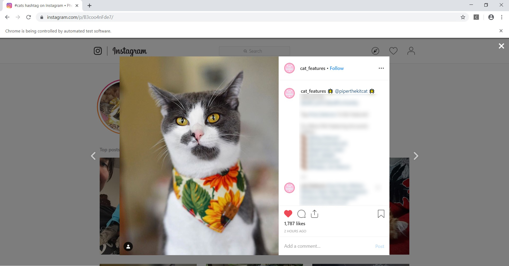
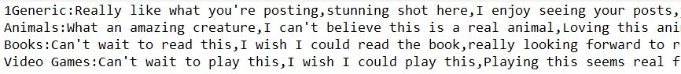
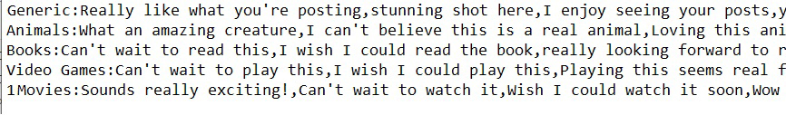
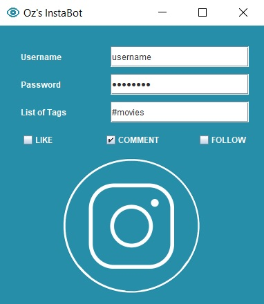

# Oz's Instabot  

A social influencer tool to aid in the automatic gathering of real followers. This helps in increasing user outreach and marketing.

Development: [Penelope Tay](https://github.com/Ozeuth)

## Development
### Current Progress: Complete with Maintenance. Possible Extension.
I update the bot when there are changes to the Instagram algorithm or Web Elements.

In the future, I may sell this software on a website. For a once-off payment, users will gain access to all future updates and technical support.
The website is currently in development by [Chang Sheng Ho](https://www.linkedin.com/in/chang-shen-ho-78067a195/)

### Current Features
1. Auto-Likes  
The InstaBot allows you to like up to 500 photos a day. This is done in real-time on a Google driver, so you can watch the photos being viewed and liked.
2. Auto-Commenting  
The InstaBot allows you to comment on 100 photos a day. You can choose what comments you want to write, and even craft your own list of comments for specific scenarios. This will be elaborated on later. 
3. Auto-Following  
The InstaBot allows you to follow up to 100 people a day. 
4. Works for Multiple Accounts  
You can of course, use this with as many accounts as you want. Each account will have the same daily limits. 
5. Low Risk of Detection  
I have made this Bot as undetectable as possible, within Instagram’s parameters (the daily like limit is 500) 
6. Private  
Your account is yours and yours alone: All your data is stored locally on your computer, and your passwords are not saved.

## Usage
### Liking
1. Click the executable file called “Oz_InstaBot”.
2. Enter your Instagram username and password. 
3. Enter the tags for images you want the bot to like. If there is more than one tag, separate them with commas. 
4. Tick the LIKE box.  

### Commenting
First you need to set up what kind of comments you wish your bots to post. 
1. Click the text file called “comments”. It will look as such on NotePad:  

2. Several premade lists have been added for you. To select the one you want, delete the ‘1’ in front of “Generic: ….” And put the 1 in front of that list.  
3. You can add/edit that list’s comments. Separate the comments using commas.
  - NOTE: Do not create a new line by hitting Enter.Add onto existing lines. 
  - NOTE: Instagram will stop you from commenting if the bot repeats the same comment too many times. To avoid this, it is recommended that you have at least 15 comments your list
4. You can add your own custom lists. Create a new list at the bottom. Below is an example of an added Movies list. It has been selected via the “1” in front.  

Then, we can start commenting.
1. Click the executable file called “Oz_InstaBot”. 
2. Enter your Instagram username and password. 
3. Enter the tags for images you want the bot to comment on. If there is more than one tag, separate them with commas. 
4. Tick the COMMENT box.  

### Following
1. Click the executable file called “Oz_InstaBot”. 
2. Enter your Instagram username and password. 
3. Enter the tags for images for which the users you want the bot to follow. If there is more than one tag, separate them with commas. 
4. Tick the FOLLOW box.  

## FAQs
1. My bot tells me “File not found”/ “Comment File not found”  
You have deleted/renamed crucial text files. Simply drop me an email and I will send you the original files again.

2. My bot tells me that a daily limit is reached  
You have liked/commented/followed the maximum amount that I believe is safe a day. Come back tomorrow and these limits will have reset

3. My bot crashes when it tries to comment  
It is likely you have tweaked the files in such a way that, (A) you did not put “1” in front of your selected list in the comment file (B) you did not put a “:” behind the list’s title. Remember, the exact template for a list you want should be: 1NAME_OF_FILE:comment1,comment2,comment3… 

4. How do I further reduce the risk of getting banned?  
While I try and make the InstaBot one of the safest on the market, there is no foolproof solution to avoid detection by Instagram. However, here are some methods I have tested to reduce detection  
- Try not to leave the InstaBot running for more than half an hr at a go.  
- Have at least a couple of posts of your own before botting. This makes you seem less like a bot.  
- Do not like/comment/follow excessively outside of running the InstaBot.  
- Monitor your bot’s activities. Before any actual banning occurs, Instagram will warn you that it is uncomfortable with your level of activity by unliking/ uncommenting/ unfollowing your last few actions. If you see this, stop the bot and you will avoid incurring penalties. NOTE: new accounts are under more stringent checks that older accounts, and accounts that normally post less will be under more stringent checks than those that regularly post more. Tweak the tips accordingly.

5. What to do if I get banned  
If you have not tweaked the base code and have followed the tips provided, it is unlikely you will be detected by Instagram. However, in the slim chance that you do:  
- Don’t panic! Chances are it is just a temporary bans. Temporary bans are usually lifted between 2 hours to 2 days.  
- Avoid using the InstaBot for the next few weeks. Post like a regular user till then. 

6. I am still having issues/ I would like to give feedback  
Feedback is always welcome. Drop me a message and I will troubleshoot.

## Happy Botting!
